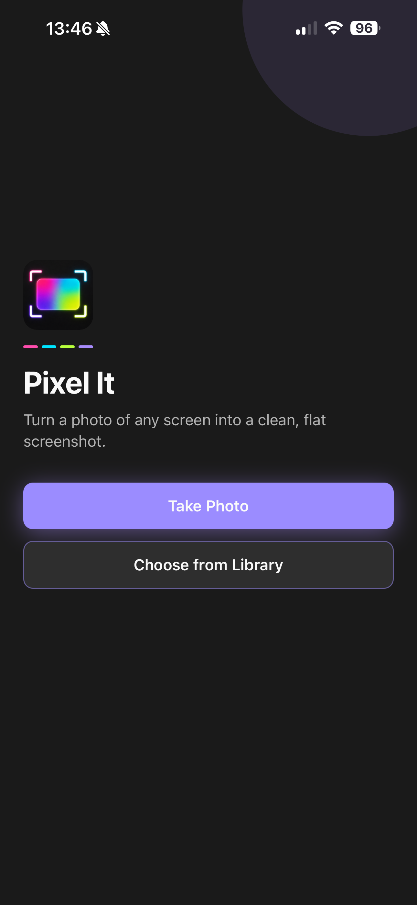
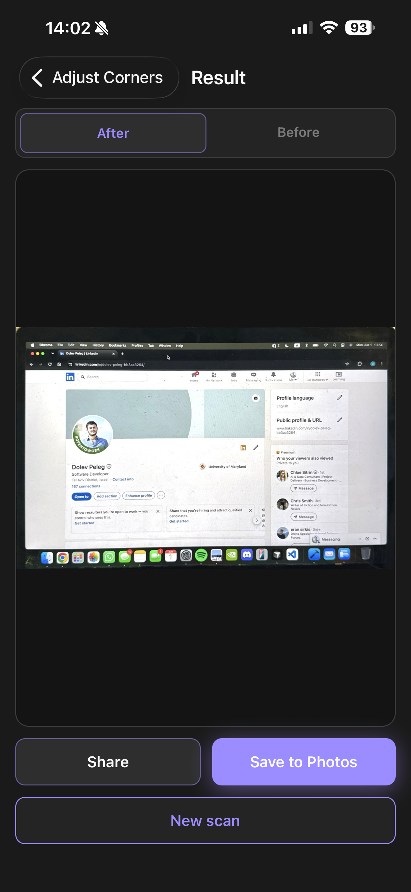
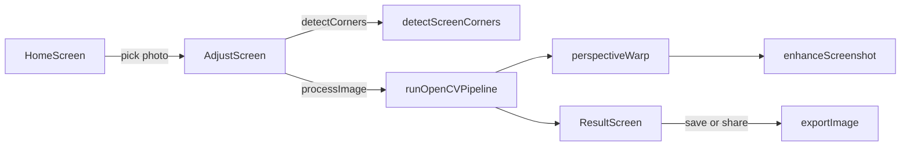

# Pixel It

Flatten photos of any screen into a clean, screenshot-like image you can save or share.

**Expo 54** · **React Native** · **TypeScript** · **OpenCV (native)**

## Screenshots

| Home | Before (angled photo) | After (screenshot-like) |
|------|---------------------|-------------------------|
|  |  |  |

## What it does

- **Capture or import** a photo of a monitor, TV, or phone screen
- **Detect screen corners** automatically, with manual drag-and-drop adjustment as a fallback
- **Flatten the image** with perspective correction and light enhancement into a **screenshot-like** result, then **save or share** it

## Important: custom dev client required

OpenCV runs through native bindings (`react-native-fast-opencv`). **Expo Go cannot run this app.** You need a **development build** (local `expo run:*` or EAS dev build). If you only run `expo start` in Expo Go, image processing will fail.

## Tech stack

| Layer | Choice |
|-------|--------|
| Framework | [Expo](https://expo.dev/) 54 + React Native |
| Language | TypeScript (strict) |
| Navigation | React Navigation (native stack) |
| Computer vision | [react-native-fast-opencv](https://github.com/lukaszkurantdev/react-native-fast-opencv) (JSI) |
| Media | expo-image-picker, expo-media-library, expo-sharing |

## Architecture



**Key modules**

| Path | Role |
|------|------|
| [`src/utils/opencv/detectScreenCorners.ts`](src/utils/opencv/detectScreenCorners.ts) | Canny edges, contours, quad scoring for auto corner detection |
| [`src/utils/opencv/perspectiveWarp.ts`](src/utils/opencv/perspectiveWarp.ts) | Perspective transform into a screenshot-like frame |
| [`src/utils/opencv/runPipeline.ts`](src/utils/opencv/runPipeline.ts) | Load → warp → enhance → save JPEG |
| [`src/screens/AdjustScreen.tsx`](src/screens/AdjustScreen.tsx) | Corner overlay, detection state, process action |

## Project structure

```
src/
  screens/       Home, Adjust, Result
  components/    Corner overlay, draggable handles, onboarding
  utils/
    opencv/      Detection, warp, enhancement, image I/O
    pickPhoto.ts normalizePhoto.ts exportImage.ts
  navigation/    Stack navigator
  theme/         Colors, typography, spacing
```

## Prerequisites

- **Node.js** 18+ (LTS recommended)
- **npm**
- **iOS:** Xcode and CocoaPods (for device or simulator builds)
- **Android:** Android Studio and SDK (for emulator or device builds)
- **Optional:** [EAS CLI](https://docs.expo.dev/build/setup/) for cloud dev builds

## Getting started

### 1. Install dependencies

```bash
git clone https://github.com/dolevpeleg1/Pixel_It.git
cd Pixel_It
npm install
```

### 2. Create a development build (first time)

Pick your platform. This compiles native code including OpenCV.

**iOS (device or simulator)**

```bash
npm run prebuild:ios
npm run ios
```

**Android**

```bash
npx expo prebuild --platform android
npm run android
```

### 3. Daily development

After the dev client is installed on your simulator or device:

```bash
npm run start:dev
```

Open the app from the dev client (not Expo Go).

### Alternative: EAS development build

If you prefer cloud builds, profiles are defined in [`eas.json`](eas.json):

```bash
eas build --profile development          # iOS device
eas build --profile development-simulator  # iOS simulator
```

Install the resulting build, then run `npm run start:dev`.

## Development & AI disclosure

This project was built as a portfolio app with a mix of **AI-assisted development**, **automated checks**, and **manual QA**.

### AI tools

- **[Cursor](https://cursor.com/)** was used throughout development for exploration, implementation, refactors, and documentation (including this README).
- AI suggestions were **reviewed and edited by hand**—especially for OpenCV logic, corner-detection heuristics, and native build setup.
- Product decisions (UX flow, visual design, detection tuning) were driven by manual iteration, not generated wholesale.

### Automated validation

| Check | What it covers |
|-------|----------------|
| **TypeScript (`strict`)** | Static types across screens, navigation params, and OpenCV utilities |
| **Dev-client smoke test** | On launch in `__DEV__`, [`verifyOpenCVLoaded`](src/utils/verifyOpenCV.ts) confirms native OpenCV bindings are available |
| **Build pipeline** | `expo prebuild` + native compile (iOS/Android) catches linking and config issues before runtime |

### Manual testing

End-to-end flows were verified on **development builds** (not Expo Go), including:

- Camera and photo-library permissions (grant, deny, retry)
- Auto corner detection vs manual corner adjustment
- Perspective warp + save to Photos + system share sheet
- Onboarding, loading states, and error paths (e.g. processing without OpenCV)

## License

[MIT](LICENSE) — Copyright (c) 2026 Dolev Peleg

## Author

**Dolev Peleg** — [GitHub @dolevpeleg1](https://github.com/dolevpeleg1)
